# Nexcoin: Design e Implementação de uma Criptomoeda Similar ao Bitcoin Usando Spring Boot e React

## Visão Geral

O Nexcoin é um projeto de aplicação full-stack que simula a infraestrutura central de uma criptomoeda inspirada no Bitcoin. O sistema implementa conceitos fundamentais de uma blockchain real, como transações, assinaturas digitais de transações, hashing de blocos e mineração. Este projeto foi desenvolvido utilizando **Java com Spring Boot** para o backend e **React** para o frontend, oferecendo uma solução robusta e interativa para explorar os princípios das criptomoedas.

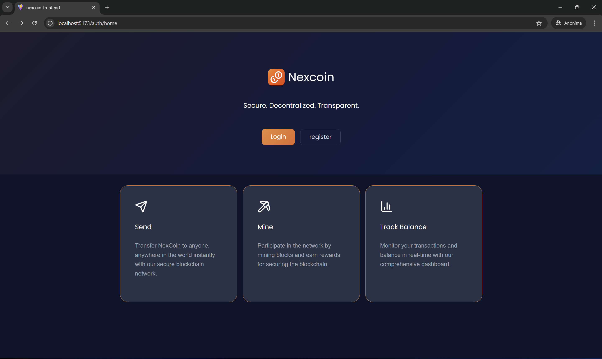

## Funcionalidades

O Nexcoin oferece as seguintes funcionalidades essenciais:

-   **Registro e Autenticação de Usuários**: Sistema completo de gerenciamento de usuários.
-   **Criação de Carteiras com Criptografia de Chaves Pública/Privada**: Geração segura de pares de chaves para cada usuário.
-   **Criação de Transações com Validação (ECDSA)**: Processamento e validação de transações utilizando o algoritmo de Assinatura Digital de Curva Elíptica.
-   **Criação de Transações de Depósito para a Própria Carteira**: Funcionalidade para adicionar fundos à carteira do usuário.
-   **Cálculo de Saldo ao Percorrer Transações**: Determinação precisa do saldo da carteira através da análise do histórico de transações.
-   **Estrutura de Blockchain com Blocos Ligados**: Implementação de uma cadeia de blocos interligados, garantindo a integridade dos dados.
-   **Mecanismo de Mineração de Blocos com Proof-Of-Work**: Simulação do processo de mineração para adicionar novos blocos à blockchain, baseado em Prova de Trabalho.
-   **Monitoramento de Histórico de Transações da Carteira**: Visualização detalhada de todas as transações associadas a uma carteira.
-   **Monitoramento do Histórico de Blocos da Blockchain**: Acompanhamento da evolução da blockchain, exibindo todos os blocos minerados.
-   **API RESTful para Comunicação entre Frontend e Backend**: Interface de programação de aplicações para a interação fluida entre as camadas da aplicação.
-   **Interface Frontend Interativa (React)**: Uma experiência de usuário rica e responsiva para interagir com o sistema Nexcoin.

---

### Registro
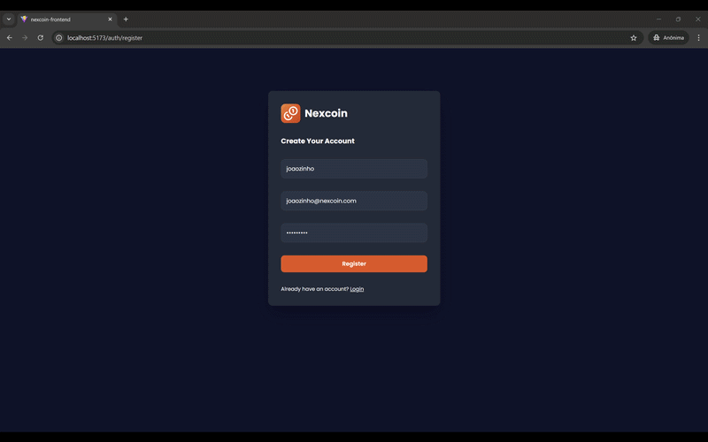

---

### Login
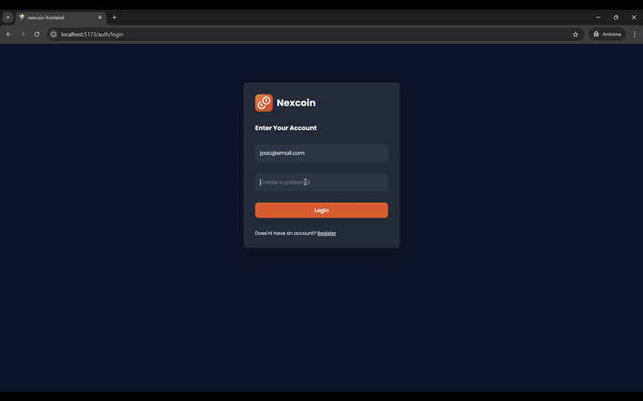

---

### Dashboard 
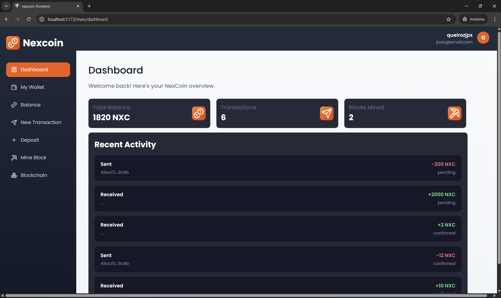
---
### Balance
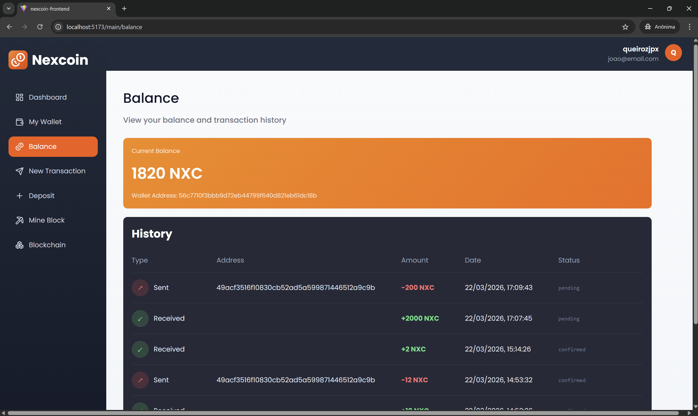
---
### Wallet
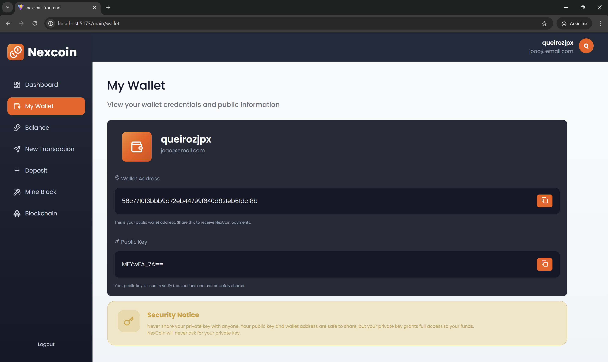

---

### Depósito
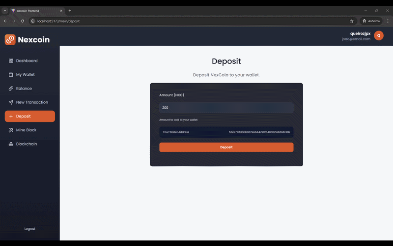

---

### Nova Transação
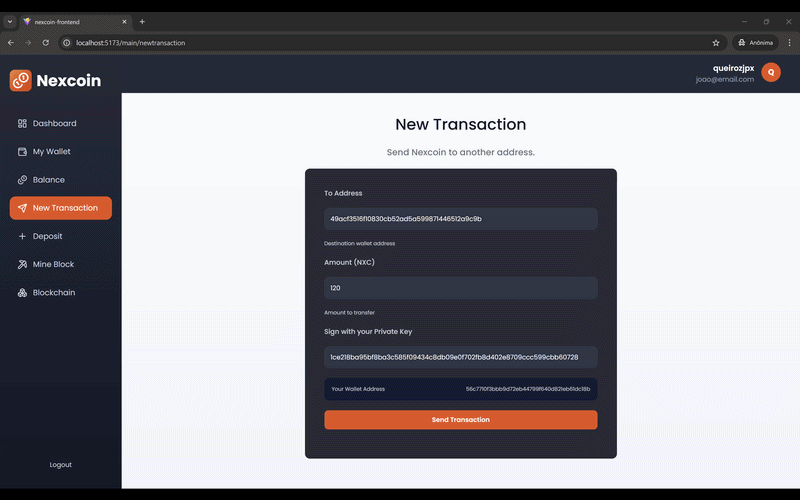

---

### Minerar Bloco
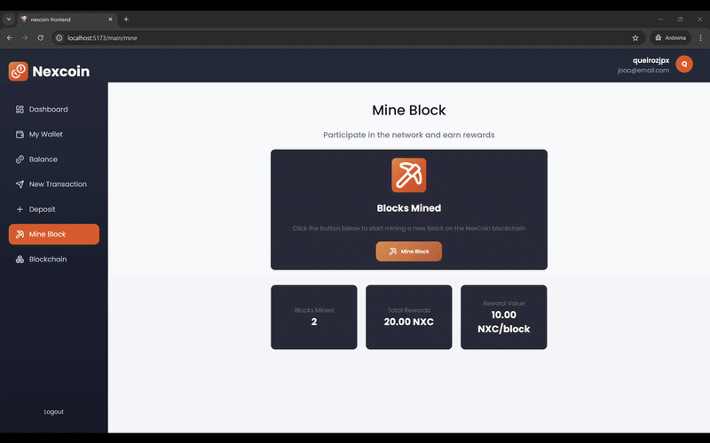

#### Saldo depois de minerar bloco
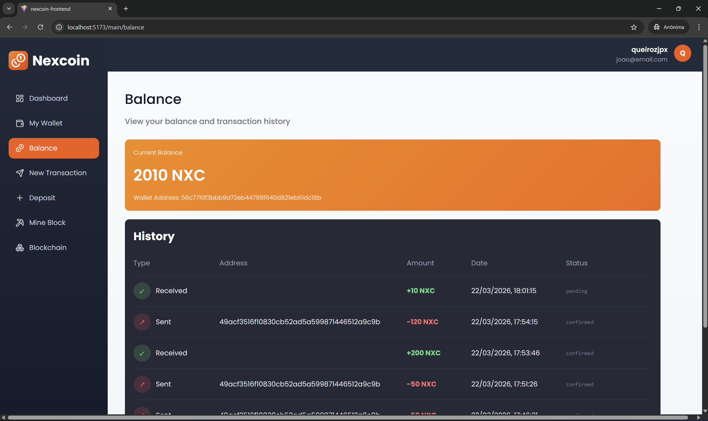

---

### Visualizar Blockchain
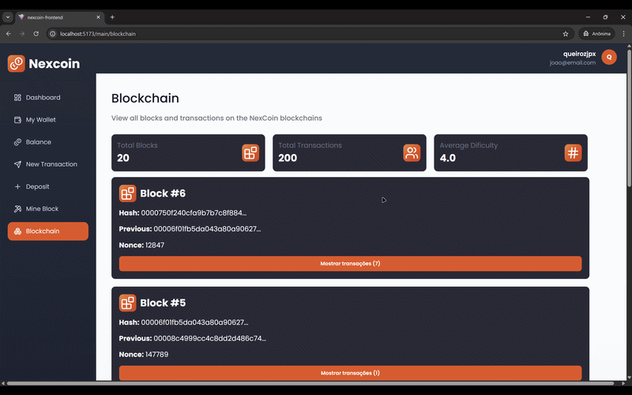

## Arquitetura

A arquitetura do Nexcoin é dividida em duas camadas principais:

### Backend (Spring Boot)

Desenvolvido em **Java com Spring Boot**, o backend é o coração da lógica de negócios e da gestão da blockchain. Ele é responsável por:

-   **API REST**: Fornece endpoints para todas as operações relacionadas à blockchain e carteiras.
-   **Validação de Transações**: Garante a integridade e autenticidade de cada transação.
-   **Mineração de Blocos**: Orquestra o processo de Proof-Of-Work para a criação de novos blocos.
-   **Configuração da Carteira**: Gerencia a criação e o estado das carteiras dos usuários.
-   **Verificação da Assinatura**: Confirma a validade das assinaturas digitais nas transações.

### Frontend (React)

A interface do usuário, construída com **React**, permite que os usuários interajam de forma intuitiva com o sistema Nexcoin. Suas funcionalidades incluem:

-   **Visualização de Dashboard, Carteira, Saldo, Transações, Blockchain**: Apresentação clara e organizada de todas as informações relevantes.
-   **Depósito de Fundos**: Interface para iniciar transações de depósito.
-   **Criação e Envio de Transações**: Formulários para a criação e submissão de novas transações.
-   **Disparo da Mineração de Blocos**: Funcionalidade para iniciar o processo de mineração.

## Tecnologias Utilizadas

### Backend

| Categoria         | Tecnologia           | Descrição                                     |
| :---------------- | :------------------- | :-------------------------------------------- |
| Linguagem         | Java 21              | Linguagem de programação principal.           |
| Framework         | Spring Boot          | Facilita o desenvolvimento de aplicações Java. |
| Web               | Spring Web           | Criação de APIs RESTful.                      |
| Persistência      | Spring Data JPA      | Gerenciamento de dados e ORM.                 |
| Segurança         | Spring Security      | Autenticação e autorização robustas.          |
| Validação         | Bean Validation      | Validação de dados de entrada.                |
| Banco de Dados    | MySQL                | Banco de dados relacional.                    |
| Autenticação      | JWT                  | Tokens de autenticação baseados em JSON.      |
| Criptografia      | Bouncy Castle        | Provedor de criptografia e assinaturas digitais. |
| Build Tool       | Maven               | Gerenciamento de dependências e build do projeto. |

### Frontend

| Categoria         | Tecnologia           | Descrição                                     |
| :---------------- | :------------------- | :-------------------------------------------- |
| Biblioteca UI     | React                | Construção de interfaces de usuário.          |
| Roteamento        | React Router DOM     | Gerenciamento de rotas na aplicação SPA.      |
| Requisições HTTP  | Axios                | Cliente HTTP para comunicação com o backend.  |
| Ícones            | Lucide-React         | Biblioteca de ícones modernos.                |
| Criptografia      | CryptoJS             | Funções criptográficas diversas.              |
| Criptografia      | Elliptic             | Implementação de ECDSA para criptografia de curvas elípticas. |

## Como Funciona

Para começar a interagir com o Nexcoin, siga os passos abaixo:

1.  **Registre-se como um novo usuário**: Ao se registrar, uma `private key` será gerada e exibida **apenas uma vez**. É crucial que você a guarde em um local seguro, pois ela é essencial para acessar e gerenciar sua carteira.
2.  **Faça login**: Após o registro, sua carteira já estará criada e associada à sua conta.
3.  **Explore as funcionalidades**: Utilize a interface para visualizar seu dashboard, saldo, histórico de transações e a blockchain. Você pode também depositar fundos, criar e enviar transações, e iniciar o processo de mineração de blocos para adicionar novas transações à cadeia.

---
## Configuração do Banco de Dados

Esta aplicação utiliza MySQL como seu banco de dados. Siga os passos abaixo para configurá-lo:

### 1. Crie o banco de dados

Execute o seguinte comando SQL para criar o banco de dados `nexcoin`:

```sql
CREATE DATABASE nexcoin;
```

### 2. Configure suas credenciais

Atualize o arquivo `application.yml` do seu projeto com as credenciais do seu banco de dados:

```yaml
spring:
  datasource:
    url: jdbc:mysql://localhost:3306/nexcoin
    username: seu_usuario
    password: sua_senha
```

### 3. Execute a aplicação

As tabelas do banco de dados serão criadas automaticamente na inicialização da aplicação, utilizando o Hibernate.

---
## Execução do Projeto

### Backend (Spring Boot)
Executar a aplicação diretamente pela IDE (IntelliJ):
- Rodar a classe principal: `NexcoinApplication.java`

### Frontend
cd nexcoin-frontend  
npm install  
npm run dev  


